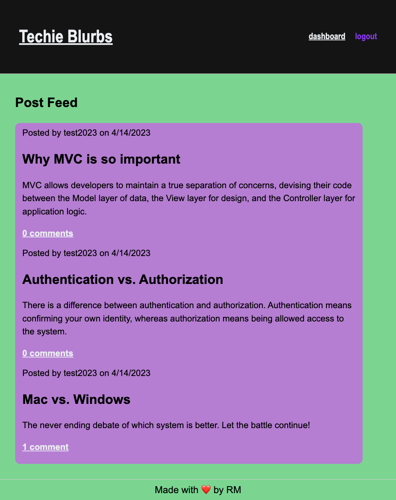
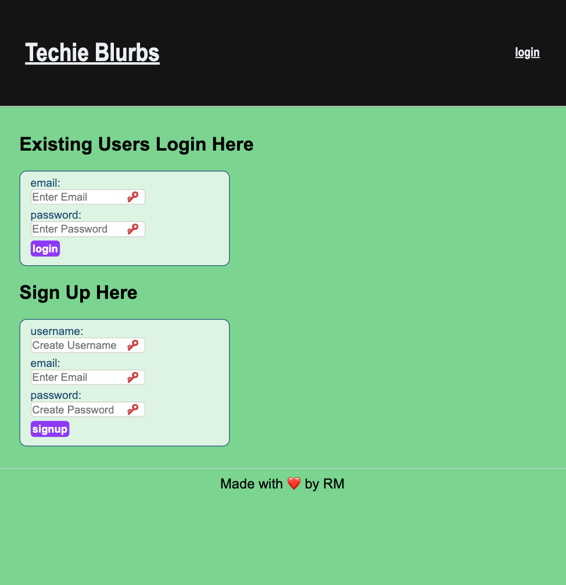
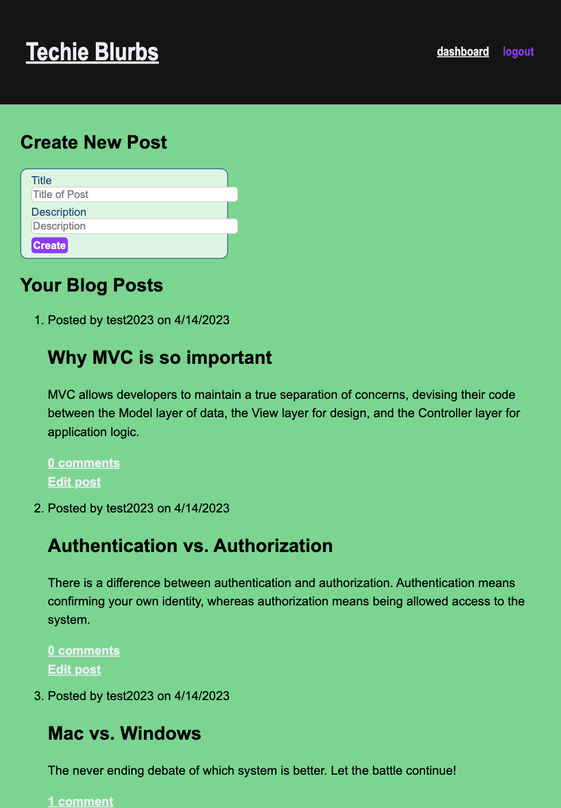

# Tech Blog: Techie Blurbs

# Description

CMS-style blog site similar to a Wordpress site, where developers can publish their blog posts and comment on other developers' posts as well. This application follows the MVC paradigm in its architectural structure, using Handlebar.js as the templating language, Sequelize as the ORM, and the express-session npm package for authentication.

# Installation

1. Clone the repository from GitHub.
2. Run `npm i` to install dependencies.
3. Create `.env` file to store credentials.
4. Run `mysql -u root -p` and enter your username, password, & database.
5. Run `source db/schema.sql;` to create database.
6. Exit mysql to entering `exit`
7. Run `npm run seeds` to seed database from the root directory in the terminal.
8. Run `npm start` from in terminal to connect to the server.
9. Open web browser to localhost:3001 to connect to the server.

## Main Page:

## Login and Sign Up Page:

## User:

# Deployment

[Heroku App: Techie Blurbs](https://techie-blurbs.herokuapp.com)
